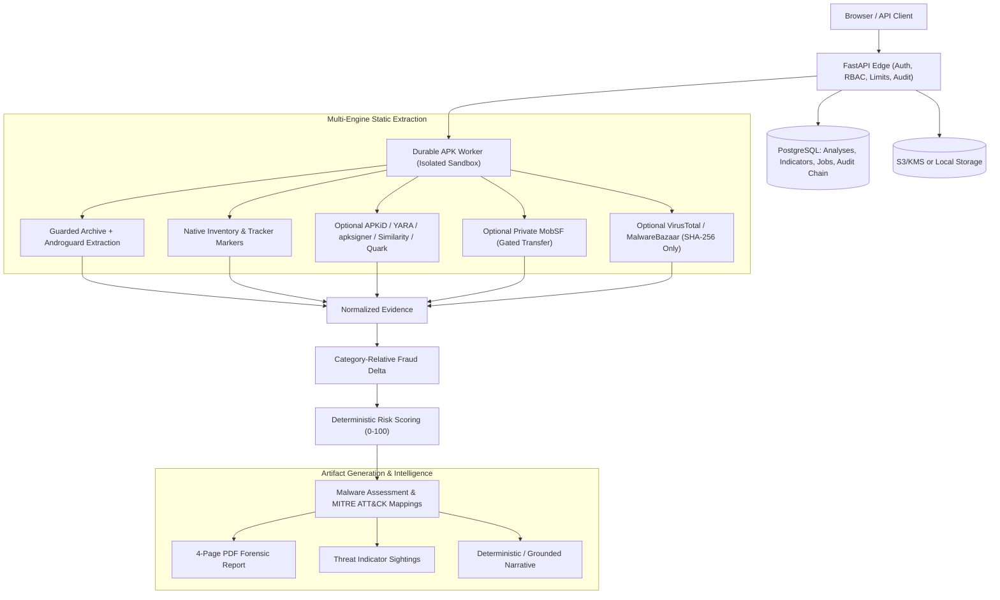

# Architecture

### Pipeline Stages

| Stage | Component | Output / Action |
|---|---|---|
| **1. Intake & Ingestion** | FastAPI Edge | Validates upload boundaries, checks SHA-256 fingerprint, persists job in lease queue |
| **2. Hostile Archive Validation** | Guarded Archive Engine | Enforces ZIP limits (20k entries, 500MB uncompressed), rejects directory traversal and zip bombs |
| **3. Static Evidence Extraction** | Androguard & Native Scanners | Extracts manifest, DEX components, permissions, receivers, certificates, URLs/IPs, strings |
| **4. Multi-Engine Orchestration** | APKiD, YARA, apksigner, Quark, MobSF | Executes available local and gated private engines; reports explicit status for unavailable tools |
| **5. Deterministic Scoring** | Rule Engine | Calculates 4 sub-scores (Credential Theft, Payment Manipulation, Impersonation, Evasion) + Fraud Delta |
| **6. Reporting & Indicators** | PDF & Intelligence Store | Emits MITRE ATT&CK Mobile mappings, IoCs (>=50 risk), and comprehensive PDF report |

## Trust boundaries

- The browser never receives service credentials. Production authentication is terminated by bank identity/access infrastructure and verified by OIDC/JWKS.
- APKs are untrusted hostile archives. Validation occurs before parsing; reads and engine execution are bounded.
- Analysis workers are a higher-risk tier than the API. Run them without root, without host mounts, with seccomp/AppArmor, resource limits, ephemeral scratch and deny-by-default egress.
- Public reputation services receive SHA-256 only and are disabled by default.
- Private MobSF receives the binary only after a separate explicit policy flag.
- Language models are optional report writers outside the score/classification trust boundary.

## Persistence

Current tables:

- `analyses`
- `indicators`
- `indicator_sightings`
- `jobs` (`apk_analysis` only in fresh v3 schemas)
- `audit_chain_state`
- `audit_events`
- `schema_migrations`

The primary result is versioned JSON. A completed analysis includes extraction, engine execution, normalized engine findings, deterministic risk, malware assessment, Fraud Delta, MITRE mappings, indicators and narrative metadata.

## Determinism and fail-safe behavior

- Rule scoring is deterministic and versioned.
- Optional engines cannot silently fail; every run has a status.
- Optional local evidence is accepted for scoring only at confidence >=0.7, with at most 25 points per engine/risk dimension.
- Reputation never lowers a behavioral score.
- Missing engines, failed lookups, not-found hashes and zero detections never imply safety.
- Partial base extraction forces an inconclusive assessment unless stronger evidence establishes a higher-risk label.
- Dynamic-lite observations do not modify the static score.

## Scaling

The API is stateless apart from database/object-store access. Multiple workers claim durable jobs with leases, retries and heartbeat renewal. Scale the API and workers separately; dedicate higher-isolation worker pools for heavy optional engines and dynamic analysis.
