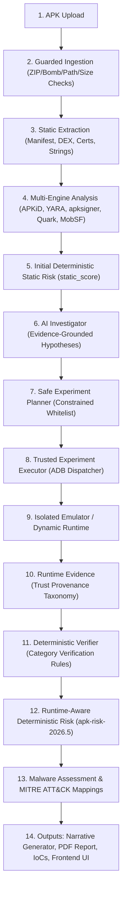

# Architecture
 

### Pipeline Stages

| Stage | Component | Output / Action |
|---|---|---|
| **1. Intake & Ingestion** | FastAPI Edge | Validates upload boundaries, checks SHA-256 fingerprint, persists job in lease queue |
| **2. Hostile Archive Validation** | Guarded Archive Engine | Enforces ZIP limits (20k entries, 500MB uncompressed), rejects directory traversal and zip bombs |
| **3. Static Evidence Extraction** | Androguard & Native Scanners | Extracts manifest, DEX components, permissions, receivers, certificates, URLs/IPs, strings |
| **4. Multi-Engine Orchestration** | APKiD, YARA, apksigner, Quark, MobSF | Executes available local and gated private engines; reports explicit status for unavailable tools |
| **5. Initial Deterministic Risk** | Scoring Engine (Stage 1) | Computes `static_score` baseline across Credential Theft, Payment Manipulation, Impersonation, Evasion + Fraud Delta |
| **6. AI Investigation Planning** | AI Investigator | Generates evidence-grounded hypotheses and constrained experiment plan (LLM cannot modify scores) |
| **7. Safe Experiment Execution** | Dynamic ADB Dispatcher | Injects controlled test signals (e.g. synthetic OTP) into isolated emulator sandbox |
| **8. Runtime Evidence Extraction** | Dynamic Collectors | Extracts process, logcat, dumpsys, and network observations with explicit `EvidenceTrustLevel` |
| **9. Deterministic Verification** | Hypothesis Verifier | Evaluates hypotheses against deterministic proof rules; computes `verified_status` and `evidence_strength` |
| **10. Two-Stage Risk Scoring** | `apk-risk-2026.5` (Stage 2) | $\text{Final Risk} = \min(100, \text{static\_score} + \text{runtime\_adjustment})$; awards capped points for verified behaviors |
| **11. Assessment & MITRE Mapping** | Assessment Engine | Generates formal verdict (`HIGH_RISK`, `KNOWN_MALICIOUS`, etc.) and MITRE ATT&CK Mobile techniques |
| **12. Reporting & Explainability** | PDF, IoC, Narrative | Emits indicators ($\ge 50$ risk), provenance graph, investigation timeline, and narrative explanation |

## Trust boundaries

- The browser never receives service credentials. Production authentication is terminated by bank identity/access infrastructure and verified by OIDC/JWKS.
- APKs are untrusted hostile archives. Validation occurs before parsing; reads and engine execution are bounded.
- Analysis workers are a higher-risk tier than the API. Run them without root, without host mounts, with seccomp/AppArmor, resource limits, ephemeral scratch and deny-by-default egress.
- Public reputation services receive SHA-256 only and are disabled by default.
- Private MobSF receives the binary only after a separate explicit policy flag.
- Two separate AI concepts exist with distinct trust boundaries:
  - **AI Investigator**: Proposes evidence-grounded hypotheses and constrained experiment plans; executes in closed loop through isolated emulator; results are verified deterministically by code. Never controls scoring.
  - **Narrative Generator**: Generates human-readable summaries and explanations from verified structured JSON; cannot alter verdicts, scores, or indicators.

## Persistence

Current tables:

- `analyses`
- `indicators`
- `indicator_sightings`
- `jobs` (`apk_analysis` only in fresh v3 schemas)
- `audit_chain_state`
- `audit_events`
- `schema_migrations`

The primary result is versioned JSON. A completed analysis includes extraction, engine execution, normalized engine findings, deterministic risk (`apk-risk-2026.5`), malware assessment, Fraud Delta, MITRE mappings, indicators, runtime evidence, hypothesis verifications, and narrative metadata.

## Determinism and fail-safe behavior

- Rule scoring is deterministic and versioned under `apk-risk-2026.5`.
- Optional engines cannot silently fail; every run has a status (`completed`, `disabled`, `unavailable`, `failed`, `blocked-by-policy`).
- Optional local evidence is accepted for scoring only at confidence >=0.7, with at most 25 points per engine/risk dimension.
- Reputation never lowers a behavioral score.
- Missing engines, failed lookups, not-found hashes and zero detections never imply safety.
- Partial base extraction forces an inconclusive assessment unless stronger evidence establishes a higher-risk label.
- Raw unverified logcat observations do not directly score; only trusted deterministically verified runtime evidence can trigger capped runtime rules (global cap +35 pts).

## Scaling

The API is stateless apart from database/object-store access. Multiple workers claim durable jobs with leases, retries and heartbeat renewal. Scale the API and workers separately; dedicate higher-isolation worker pools for heavy optional engines and dynamic analysis.
